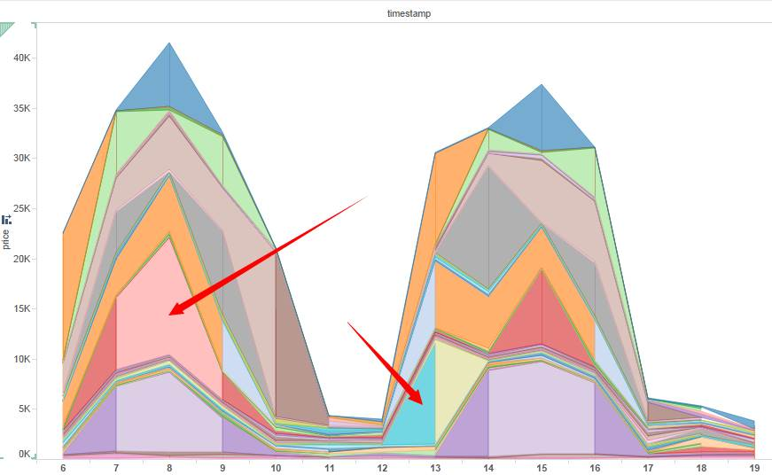

# Vast Challenge 2021: Mini-Challenge 2

# Background
Many of the Abila, Kronos-based employees of GAStech have company cars which are approved for both personal and business use. Those who do not have company cars have the ability to check out company trucks for business use, but these trucks cannot be used for personal business.

Employees with company cars are happy to have these vehicles, because the company cars are generally much higher quality than the cars they would be able to afford otherwise. However, GAStech does not trust their employees. Without the employees? knowledge, GAStech has installed geospatial tracking software in the company vehicles. The vehicles are tracked periodically as long as they are moving.

This vehicle tracking data has been made available to law enforcement to support their investigation. Unfortunately, data is not available for the day the GAStech employees went missing. Data is only available for the two weeks prior to the disappearance.

To promote local businesses, Kronos based companies provide a Kronos Kares benefit card to GASTech employees giving them discounts and rewards in exchange for collecting information about their credit card purchases and preferences as recorded on loyalty cards. This data has been made available to investigators in the hopes that it can help resolve the situation. However, Kronos Kares does not collect personal information beyond purchases.

As a visual analytics expert assisting law enforcement, your mission is to identify which GASTech employees made which purchases and identify suspicious patterns of behavior. You must cope with uncertainties that result from missing, conflicting, and imperfect data to make recommendations for further investigation.


# Questions
1.	Using just the credit and loyalty card data, identify the most popular locations, and when they are popular. What anomalies do you see? What corrections would you recommend to correct these anomalies? Please limit your answer to 8 images and 300 words.

2.	Add the vehicle data to your analysis of the credit and loyalty card data. How does your assessment of the anomalies in question 1 change based on this new data? What discrepancies between vehicle, credit, and loyalty card data do you find? Please limit your answer to 8 images and 500 words.

3.	Can you infer the owners of each credit card and loyalty card? What is your evidence? Where are there uncertainties in your method? Where are there uncertainties in the data? Please limit your answer to 8 images and 500 words.

4.	Given the data sources provided, identify potential informal or unofficial relationships among GASTech personnel. Provide evidence for these relationships. Please limit your response to 8 images and 500 words.

5.	Do you see evidence of suspicious activity? Identify 1- 10 locations where you believe the suspicious activity is occurring, and why Please limit your response to 10 images and 500 words.


# Scope of work

To address the questions above, below is the required scope of work
1. Literature Review
2. Data preparation
3. Methodology and visualisation
4. Answers
5. Acknowledgment


# 1. Literature Review

This year Vast Challenge uses the same question based on 2014 Vast Challenge. As such, we will conduct literature review on past 2014 Vast Challenge submission based on MC2 – Patterns of Life Analysis. We will select some of the past submission to identify some of the gaps that can potentially utilized interactive data visualization techniques to improve user experiences. The repository for 2014 Vast Challenge – MC2: Patterns of Life Analysis submissions can be found  [here](http://visualdata.wustl.edu/varepository/VAST%20Challenge%202014/challenges/MC2%20-%20Patterns%20of%20Life%20Analysis/)


## 1.1 University of Buenos Aries - Arcaya.

The localization of different people based on bar chart is difficult to visualize as there are too many people with indicated by different type of colours and there are too many locations thereby squeezing the bar chart altogether. A recommendation is to split 
location up into 3-4 groups so that it will be easier to visualize.


## 1.2 Shandong University

The price vs consumption area by using density plot is not a very good idea as it is very confusing to know which employee is which as there are too many employees squeeze into one chart. There is no legend or tooltip to indicate the employees.



## 1.3. ASTRI

The bar chart used to indicate less frequented location is too squeezy especially those portion with many departments squeeze into one location. These makes it difficult for people to analyse. A recommendation is to group the data into lesser locations and possibly provided some interactivity where user can click the legend to select the department they want.


# 2. Data preparation

## 2.1 Customisation of code chunks

First, we will customize the all code chunks using the below knitr code. More information on chunk options can be found [here](https://yihui.org/knitr/options/#animation)
```{r setup, include=FALSE}
options(htmltools.dir.version = FALSE)
knitr::opts_chunk$set(echo = TRUE,
                      eval = TRUE,
                      fig.retina = 3,
                      message = FALSE,
                      warning = FALSE)
```

## 2.2 Installing required R packages

Next, we will install the required R packages. There are three basic groups of packages that we will install,

1) For data manipulation and preparation
The [*tidyverse*](https://www.tidyverse.org/) package is a group of R packages including [*dplyr*](https://dplyr.tidyverse.org/), [*tidyr*](https://tidyr.tidyverse.org/) that assist user to manipulate data.

2) Date and Time
The two packages [*clock*](https://clock.r-lib.org/) and  [*lubridate*](https://lubridate.tidyverse.org/) are used for the manipulation of date and time data

3) Interactive data analysis
The two packages [*ggiraph*](https://cran.rstudio.com/web/packages/ggiraph/ggiraph.pdf) and [*plotly*](https://plotly.com/r/) are used to output data into interactive graphical/chart form for analysis.

4) GeoVisual Analysis
The packages [*raster*](https://cran.r-project.org/web/packages/raster/raster.pdf), [*sf*](https://r-spatial.github.io/sf/),[*tmap*](https://cran.r-project.org/web/packages/tmap/vignettes/tmap-getstarted.html) and [*rgdal*](https://cran.r-project.org/web/packages/rgdal/index.html) are used for geospatial visual analytics where data are output to a map for analysis such as movement of people etc.

5) Network Analysis
Lastly, to analyse the relationship between people etc. We will use the packages from [*tidygraph*](https://www.data-imaginist.com/2017/introducing-tidygraph/), [*igraph*](https://igraph.org/), [*ggraph*](https://www.data-imaginist.com/2017/ggraph-introduction-layouts/) and [*visNetwork*](https://datastorm-open.github.io/visNetwork/#:~:text=visNetwork%20is%20an%20R%20package,%2Fdatastorm%2Dopen%2FvisNetwork.). *visNetwork* is a package to output interactive network analysis. 

```{r}
packages = c('DT','ggiraph','plotly','tidyverse', 'raster','sf','clock','tmap',
             'rgdal','dplyr', 'tidyr', 'textclean', "plotly", "forcats", "jpeg", "tiff",
             "mapview","tidygraph","igraph","ggraph","visNetwork","leaflet","lubridate")
for(p in packages){
  if(!require(p,character.only = T)){
    install.packages(p)
  }
  library(p,character.only = T)
}
```

## 2.3 Provided data and information
There are 3 different types of data & information provided. A *geospatial dataset*, *csv files* and a *jpg file* consisting of the Abila tourist map.

Below is the information of all the data provided.

### 2.3.1. A csv file on vehicle assignments to employee (car-assignments.csv)

1) Employee Last Name

2) Employee First Name

3) Car ID (integer)

4) Current Employment Type (Department; categorical)

5) Current Employment Title (job title; categorical)

### 2.3.2.	A CSV file of vehicle tracking data (gps.csv)

3.1	Timestamp

3.2	Car ID (integer)

3.3	Latitude

3.4	Longitude

### 2.3.3.	A CSV file containing loyalty card transaction data (loyalty_data.csv)

4.1	Timestamp

4.2	Location (name of the business)

4.3	Price (real)

4.4	Loyalty Number (A 5-character code starting with L that is unique for each card)


### 2.3.4.	A CSV file containing credit and debit card transaction data (cc_data.csv)

5.1	Timestamp

5.2	Location (name of the business)

5.3	Price (real)

5.4	Last 4 digits of the credit or debit card number

### 2.3.5.	ESRI shapefiles of Abila (in the Geospatial folder)

### 2.3.6.	A tourist map of Abila with locations of interest identified, in JPEG format (MC2-Tourist.jpg)


## 2.4. Importing of data

We will import the 4 different *csv* datasets that were provided


```{r}
car <- read_csv("data/mc2/car-assignments.csv")
cc <- read_csv("data/mc2/cc_data.csv")
gps <- read_csv("data/mc2/gps.csv")
loyalty <- read_csv("data/mc2/loyalty_data.csv")
```

If we take a look at the above datasets in excel, we will see that there are foreign characters in some of the datasets provided. An example is the Katerina's Cafe as shown below. To address this, we will need to encode the dataset to allow rstudio to read properly. 


To allow use to know the encoding type for both cc and loyalty dataset. Guess encoding will be used to detect the encoding type as shown below..


```{r}
guess_encoding(cc)
guess_encoding(loyalty)
```

Next, we will add the code locale = locale(encoding = "ASCII" on both cc and loyalty dataset)


```{r}
car <- read_csv("data/mc2/car-assignments.csv")
cc <- read_csv("data/mc2/cc_data.csv", locale = locale(encoding = "ASCII"))
gps <- read_csv("data/mc2/gps.csv")
loyalty <- read_csv("data/mc2/loyalty_data.csv",locale = locale(encoding = "ASCII"))
```

## 2.5. Data examination

First, we will look at both cc and loyalty card dataset by using the *glimpse* function as shown below. There are 1490 rows and 1392 rows in both the cc and loyatly dataset respectfully. If we take look closely, we will see that these two datasets are closely linked by location, price and timestamp except the last4ccnum and loyaltynum are different. 

If we take a look back at the MC2 background, we will observe that Kronos based companies are allowed to collect credit card and loyalty cards information on GAStech employees purchases as such these two datasets are similar in nature. 

However, the rows for both cc and loyalty card data are different. This anomaly might have a few reasoning, 1) the employees did not used their credit cards while doing purchases but loyalty card was presented. 2) Vice versa, employees might also used their credit card but did not present their loyalty card during purchases.


```{r}
glimpse(cc)
glimpse(loyalty)
```

Next, we will look at the vehicle datasets. The 44 rows car datasets are represented by the employee, employment information with their car assignment ID.

The gps datasets are based on the car movements in respect to their lat and long position with timestamp.


```{r}
glimpse(car)
glimpse(gps)

```

## 2.6. Data Preparation

### 2.6.1 CC and Loyalty dataset

We will prepare the cc and loyalty datasets for data exploration later.

### 2.6.1.1. Changing the datatypes of last4ccnum & loyaltynum

The last4ccnum of the cc datasets and the loyaltynum of the loyalty dataset should be a categorical data type. As such, we will change it by using the *as.factor* function. 


```{r}
cc$last4ccnum <- as.factor(cc$last4ccnum)
loyalty$loyaltynum <- as.factor(loyalty$loyaltynum)
```

Next, we will modify the datatype for both the timestamp of cc and loyalty dataset using the *clock* package. If we observe below, the data_time_parse function is use to change the timestamp to *dttm* (datetime) format while the date_parse function is used to change the data to *date* format.


```{r}
cc$timestamp <- date_time_parse(cc$timestamp,
                                 zone = "",
                                 format = "%m/%d/%Y %H:%M")

loyalty$timestamp <- date_parse(loyalty$timestamp,
                                 format = "%m/%d/%Y")

```


We will double check the dataset to confirm that the datatype has been changed to the one we wanted.


```{r}
glimpse(cc)
glimpse(loyalty)

```

### 2.6.1.2 Splitting the timestamp data into individual date, time and day columns.

To allow us to dive deeper into our analysis later, we will split the timestamp dataset into date, time and day columns. We will first add more columns by using the *mutate* function from dplyr to add day, date and time columns in the cc dataset and importing in to the *cc_dtsplit* object.

There is no need to add columns for the loyatly dataset as we will join both the datasets together in which day will be included in the joined dataset.

```{r}
cc_dtsplit <- cc %>%
  mutate(day = date_weekday_factor(cc$timestamp), date =  as_date(cc$timestamp), time = format(cc$timestamp, format = "%H:%M"))

cc_dtsplit

```

To allow us to join both datasets together, we will need to rename the timestamp column from the loyatly dataset to *date* so that both the date columns have the same name.


```{r}
loyalty_dt <- rename(loyalty, date = timestamp)

```

We will take a look at our newly cleaned datasets to double check the changed we have made previously.


```{r}
glimpse(cc_dtsplit)
glimpse(loyalty_dt)

```

### 2.6.1.3. Changing the datatypes of car & gps

First, we will take a look at the car & gps datasets. Notice that the CarID and id for both datasets are not of the correct categorical datatype. We will proceed to change both the two columns.


```{r}
glimpse(car)
glimpse(gps)

```
Changing of CarID and ID to categorical data.


```{r}
car$CarID = as.factor(car$CarID)
gps$id = as.factor(gps$id)

```

### 2.6.1.4. Combining both first and last name.
 
Next, we will combine both first and last name of the car datasets into one column for us to analyse the person easily. We will use the *tidyr* function unite to unify both the first and last name into *name*.


```{r}
car_unite <- car %>%
  unite(col = "name", LastName,FirstName, sep = ", ",  remove =FALSE) 

```


### 2.6.1.5. Change datatype of time and rename id to Carid

Next, we will rename the id of gps to CarID to match with the car_unite data. Additionally, the Timestamp data of gps will be changed to the dttm format


```{r}
gps_cleaned <- rename(gps,CarID = id)

gps_cleaned$Timestamp <- date_time_parse(gps_cleaned$Timestamp,
                                 zone = "",
                                 format = "%m/%d/%Y %H:%M")

```

Lastly, we will look at our cleaned dataset and we have done cleaning the data.


```{r}
glimpse(car_unite)
glimpse(gps_cleaned)

```

# 3. Methodology and Visualisation methods

Below we will discuss some methodology and visualization methods used to answer the questions later.

### 3.1. Bar Chart

First, we will be using a bar chart to analyse the number of patrons to each location. A bar chart is very useful to analyse categorical data based on number of instances.

The code uses both tidyverse and plotly packages to create the bar chart. First, a count was used to count each location by visits. Then a mutate function was used  to create and sort the location by count in descending order. Next, a plotly bar chart was created by indicating the x and y axis with additional layout for the chart. 

The plotly bar chart is accessible later in the question segment.


### 3.2. Line chart

To visualize timeseries data, a time-series line chart is great for analysis. 

The below line chart uses the top few most visited places to plot into a timeseries line.


### 3.3. Geospatial visualization

Next, a geospatial map visualisation is created to analyse the movement of each vehicle.


### 3.4. Network analysis

An interactive network data analysis is created to visualise the realtionship between each person.

Notice that the carid can be selected to see its relationship between other carid. Those that are nearest and highlighted are carid that have a close relationship with the person of interest.


# 4. Answers

### 4.1.  Using just the credit and loyalty card data, identify the most popular locations, and when they are popular. What anomalies do you see? What corrections would you recommend to correct these anomalies? Please limit your answer to 8 images and 300 words.


As shown previosuly in our data preparation segment, there is a difference in rows (difference of 98 rows) between the cc and loyalty card data. This shows an anomaly that one of the cards were used but not both during purchases which might results in a difference in number of entries.


```{r}

glimpse(cc_dtsplit)
glimpse(loyalty_dt)
```

As explained previously, the cc and loyalty dataset are similar in nature with just an exception of the last4ccnum and loyaltynum, therefore, a join is required to match rows where the users uses both cc and loyalty card data. However, before a join is performed, we will analyse both the cc and loyalty dataset based on location counts.


A first exploratory data analysis by using a bar chart is performed on the cc_dtsplit dataset to find out the location which were patronize the most. 

Based on the bar chart below, we are able to observe that there are 4 locations that are siginificantly higher in visitors than the rest of the locations. The highest is Katerina's cafe with a total of 212 visits followed by Hippokampos, Guys'Gyros and Brew's been served. These four places excluding Hippokampos which is not determinable in the map provided are all restaurants/bars.


```{r}
cc_dtsplit_bar <- cc_dtsplit %>%
  count(location) %>%
  mutate(location = fct_reorder(location, n, .desc =TRUE)) %>%
  plot_ly(x = ~location, y = ~n, marker = list(color = ~n)) %>%
  add_bars() %>%
  layout(title = "Total number of visitation by location", xaxis = list(title = ""),yaxis = list(title = "Number of visitors"))

cc_dtsplit_bar
```


Next, we will take a look at the loyalty_dt dataset.

Based on the bar chart below, we are able to observe that the 4 locations that were visited mostly are the same four locations that was shown on the cc_dtsplit dataset.

One difference is that *Ouzeri Elian* jumps to the fifth spot which differs from the cc_dtsplit dataset where *Ouzeri Elian* is in the sixth spot.


```{r}
loyalty_dt_bar <- loyalty_dt %>%
  count(location) %>%
  mutate(location = fct_reorder(location, n, .desc =TRUE)) %>%
  plot_ly(x = ~location, y = ~n, marker = list(color = ~n)) %>%
  add_bars() %>%
  layout(title = "Total number of visitation by ", xaxis = list(title = ""),yaxis = list(title = "Number of visitors"))

loyalty_dt_bar
```


Next, an inner join will be conducted by joining date, location and price and will will output into a new object *cc_loyalty_join*.

Notice that there are only 1,087 rows wheareas both cc_dtsplit and loyalty_dt has 1490 and 1392 rows respectfully. These shows that some of the data in cc does not match the loyalty data which strengthens the initial anomaly that some of the employees uses one of each card but not both during purchases.


```{r}
cc_loyalty_join <- cc_dtsplit %>%
  inner_join(loyalty_dt, by = c("date","location", "price"))

cc_loyalty_join
```

After joining the dataset, we found that there are 1087 rows of data available. This means that some of the credit card purchases are not linked to any of the loyalty card, vice versa, some of the loyalty card are not linked to the credit card purchases. These strengthen the anomaly that we have highlighted before. We will take a look at those datasets that does not match later.


Before we begin further analysis on further anomalies between the two datasets. We shall conduct some exploratory data analysis. First, we will analyse the most popular place visited during the duration of study.

To do the above, we will group all the location by the number of visitations. Taking a look at the raw output, we can see that the 4 most visited place is the same four as mentioned previosuly.


```{r}
cc_location_count <- cc_loyalty_join %>%
  group_by(location) %>%
  summarize(count = n()) %>%
  arrange(desc(count))

cc_location_count

```

Next, a bar chart is produced sorted descendingly by the number of visitations.


```{r}
cc_join <- cc_loyalty_join %>%
  count(location) %>%
  mutate(location = fct_reorder(location, n, .desc =TRUE)) %>%
  plot_ly(x = ~location, y = ~n, marker = list(color = ~n)) %>%
  add_bars(name = "inner-join") %>%
  layout(title = "Total number of visitation by area", xaxis = list(title = ""),yaxis = list(title = "Number of visitors"))

cc_join
```

From the chart above, we can observe that *"Katerine"s Cafe" (155 counts)*, *"Guy's Gyros" (121 counts)*, *"Hippokampos" (117 counts)*, *"Brew've Been Serve" (111 counts)* have the most visitation during the period of study. If we take a look closely, the 4th most visited place is actually around 2x the 5th most visited place. This shows that top 4 most visited places takes up most of places visited by patrons. 


Although we have shown the overall most visited places. However, the more interesting analysis lies in when are the places visited by patrons. As such, we will group the joined data by location, date, day and time to see at which point of time was the location the most.


```{r}
cc_loyalty_group <- cc_loyalty_join %>%
  group_by(location,date,day,time) %>%
  summarize(count = n()) %>%
  arrange(desc(count)) %>%
  ungroup()

cc_loyalty_group

```

From the above table we can already observe that "Bean There Done That" was patronized the most at one point of time. Next, are "Guy's Gyros" and "Jack's Magical Beans". Interestingly, "Bean There Done That" has the highest count of high visitation at one point of time.

Next, we will plot a line chart of the restaurant based on count of 3 or more based on a time series line chart to see if there is a trend. The reason to plot 3 or more is to show those location that were highly visited at one point of time.

We will first filter the dataset.

```{r}
cc_loyalty_top <- cc_loyalty_group %>%
  filter(count >= 3) %>%
  ungroup()

```


Next, we will create the line chart. 

Based on the most frequented places, we can see that January 13 clock the highest count for one day. Additonally, Bean there done that has clocked the highest visitations per day followed by Jack's Magical Beans.


```{r}
cc_timeseries <- cc_loyalty_top %>%
  plot_ly(x = ~date, y =~count, color = ~location, hoverinfo = "text",
          text = ~paste("Location:", location, "<br>","Date:", date, "<br>","Time:", time, "<br>", "Day:", day)) %>%
  add_lines() %>%
  add_markers(showlegend = FALSE) %>%
  layout(title = "Most frequented places by groups of people", xaxis = list(title = "", dtick = ~date, showgrid = FALSE), yaxis = list(title = "Number of people"))

cc_timeseries
```


Next, we will analyse the highest frequented location based on day and time. To do that, we will need to use this unite to combine both day and time together and group the, by location and daytime.

```{r}
cc_loyalty_day <- cc_loyalty_join %>%
  unite(col = "daytime", day,time, sep = " ",  remove =FALSE) %>%
  group_by(location, daytime) %>%
  summarize(count = n()) %>%
  arrange(desc(count))

cc_loyalty_day
```

Next, a bar chart is plotted by filtering out those with more than or equal to 5. From the bar chart, we are able to see that Bean there done that has the highest visitations at a point of time, this is similar to the analysis we did before. The highest is 11 counts on Mon, 12:00H, next is Fri, 12:00H with 11 counts. The nect highest visited location at a point of time is Jack's Magical Beans which clock 7 counts on Mon, 12:00H, followed by Thu, 12:00H of 6 counts.


```{r}
cc_day <- cc_loyalty_day %>%
  filter(count >=5) %>%
  plot_ly(x = ~daytime, y = ~count, color = ~location, hoverinfo = "text", text = ~paste("Location:", location, "<br>","Day Time:", daytime, "<br>", "No.of visitors:", count)) %>%
  add_bars() %>%
  layout (title = "Total counts of visitors by day and time", xaxis = list(title = "", size = 3, dtick = ~daytime), yaxis = list(title = "Number of visitors") )

cc_day

```

Having completed some EDA by inner joining both cc and loyalty dataset. We will sieve out those dataset that were in cc but not in loyalty. The method to do this is by using anti-join. Anti-join will take out those dataset that does not belongs to the secondary dataset but in the main dataset.

This method is similar to full join therafter sieving those NA values.

From the anti-joined data below, we are able to see that there are 409 rows that were in cc but not in loyalty. This form an anomaly that cc were used in the purchases but not the loyalty card. 


```{r}
cc_loyalty_antijoin <- cc_dtsplit %>%
  anti_join(loyalty_dt, by = c("date","location", "price"))


cc_loyalty_antijoin
```

Next, we will create a basic bar chart based on the anti join dataset.

Based on the bar chart below, we can see that similar to the inner join dataset, the four locations are Katerina's Cafe, Hippokampos, Brew's been served and Guy's Gyros with the highest count of 59 clock at Katerina's Cafe.

One major difference between this anti joined dataset versus the inner joined is that the descending gradient for each restaurant is not as steep as the inner joined. In the inner joined dataset, the 4th highest visited location is almost 2x the 5th highest visited location. As for the below chart, we can see that the decrement is not that steep.


```{r}
cc_anti <- cc_loyalty_antijoin %>%
  count(location) %>%
  mutate(location = fct_reorder(location, n, .desc =TRUE)) %>%
  plot_ly(x = ~location, y = ~n, marker = list(color = ~n)) %>%
  add_bars(name = "anti-join") %>%
  layout(title = "Total number of visitation by area", xaxis = list(title = "", automargin = TRUE),yaxis = list(title = "Number of visitors", automargin = TRUE))

cc_anti
```

Next, we will group the anti joined dataset to extract the number of visitations at a point of time. Based on the raw grouped data below, we can see that the count of visitations is quite linear with no high variations observed.


```{r}
cc_loyalty_anti_group <- cc_loyalty_antijoin %>%
  group_by(location, day, date, time) %>%
  summarize(count = n()) %>%
  arrange(desc(count)) %>%
  ungroup()

cc_loyalty_anti_group
```

Using the group data, we will create a time-series chart to see the trend throughout the duration of study. We will output those data with count of more than or equal to 2.

Based on the chart below, we can observe that Bean there done that and Jack's Magical Beans at one point has the highest visitations of 3 transactions. The rest of the location are quite constant with 2 transactions.

```{r}
 cc_anti_timeseries <- cc_loyalty_anti_group %>%
  filter(count >= 2) %>%
  plot_ly(x = ~date, y =~count, color = ~location, hoverinfo = "text",
          text = ~paste("Location:", location, "<br>","Date:", date, "<br>","Time:", time, "<br>", "Day:", day)) %>%
  add_lines() %>%
  add_markers(showlegend = FALSE) %>%
  layout(title = "Most frequented places by groups of people", xaxis = list(title = "", dtick = ~date, showgrid = FALSE), yaxis = list(title = "Number of people"))

cc_anti_timeseries
```


Similar to the above inner joined dataset, we will create a daytime column to observe which daytime has the highest count.

```{r}
cc_loyalty_day_anti <- cc_loyalty_antijoin %>%
  unite(col = "daytime", day,time, sep = " ",  remove =FALSE) %>%
  group_by(location, daytime) %>%
  summarize(count = n()) %>%
  arrange(desc(count))

cc_loyalty_day_anti
```

Based on the chart below, we can see that the highest count per daytime is 5 counts of visitors at Bean there done that which was clocked on Tue, 12:00pm followed by Jack's Magical bean of 4 counts on the same day.  

```{r}
cc_anti_day <- cc_loyalty_day_anti %>%
  filter(count >=3) %>%
  plot_ly(x = ~daytime, y = ~count, color = ~location, hoverinfo = "text", text = ~paste("Location:", location, "<br>","Day Time:", daytime, "<br>", "No.of visitors:", count)) %>%
  add_bars() %>%
  layout (title = "Total counts of visitors by day and time", xaxis = list(title = "", size = 3, dtick = ~daytime), automargin = TRUE, yaxis = list(title = "Number of visitors"))

cc_anti_day

```

Next, we will anti join from loyalty to cc.

Based on the anti-joined data, we observe that there are 311 rows of transaction which uses loyalty card with no credit card.

```{r}
cc_loyalty_antijoin_right <- loyalty_dt%>%
  anti_join(cc_dtsplit, by = c("date","location", "price")) %>%
  ungroup()

cc_loyalty_antijoin_right

```

Notice that there is no day after the anti join was performed this is due to the fact that originally, the loyalty_dt dataset does not have the day included. As such, day is being created using the date_weekday_factor function.


```{r}
cc_loyalty_antijoin_mutate <- cc_loyalty_antijoin_right %>%
  mutate(day = date_weekday_factor(cc_loyalty_antijoin_right$date))
cc_loyalty_antijoin_mutate

```

Similar to the previous inner join and left anti join data. The four highest visited locations are Katerina's Cafe, Hippokampos, Brew's been served and Guy's Gyros. 

Katerina's Cafe and Hippokampos lead the two most visited location of 42 and 40 respectively.


```{r}
cc_anti_right <- cc_loyalty_antijoin_mutate %>%
  count(location) %>%
  mutate(location = fct_reorder(location, n, .desc =TRUE)) %>%
  plot_ly(x = ~location, y = ~n, marker = list(color = ~n)) %>%
  add_bars(name = "anti-join-right") %>%
  layout(title = "Total number of visitation by area", xaxis = list(title = "", automargin = TRUE),yaxis = list(title = "Number of visitors", automargin = TRUE))

cc_anti_right
```

Next, we will group the right anti joined dataset to get the count per day based on location. 

From the below chart, we can see that Hallowed Grounds have the highest count of 6 visitations on 2014-01-09.


```{r}
cc_loyalty_day_anti_right <- cc_loyalty_antijoin_mutate %>%
  group_by(location, date,day) %>%
  summarize(count = n()) %>%
  arrange(desc(count)) %>%
  ungroup()

cc_loyalty_day_anti_right
```

Next, we will created a bar chart to analyse those visitations of more than or equal to 4 counts. Based on the chart below, we can see that although Hallowed Grounds has the highest visitation at one point, however, it only clock once. This is also considered another anomaly as the count of visitations is not consistent in the dataset provided.

The next highest count of 5 visitations were clocked by Guys's Gyros on 2014-01-15, Hippokampos on 2014-01-10, Katerina's Cafe and Brew's been served on three different occasions.


```{r}
cc_anti_day_right <- cc_loyalty_day_anti_right %>%
  unite(col = "daydate", day, date, sep = " ", remove = FALSE) %>%
  filter(count >=4) %>%
  plot_ly(x = ~daydate, y = ~count, color = ~location, hoverinfo = "text", text = ~paste("Location:", location, "<br>","DayDate:", daydate, "<br>", "No.of visitors:", count)) %>%
  add_bars() %>%
  layout (title = "Total counts of visitors by date", xaxis = list(title = "", size = 3, dtick = ~daydate), automargin = TRUE, yaxis = list(title = "Number of visitors"))

cc_anti_day_right

```

Next, we will created a time-series chart to see the trends of visitations to the respective locations.

One more peculiar occurrence can be discovered from the chart below. Brew's Been Served has 5 transactions consecutively for 3 days. However, after which no visits were recorded of Brew've been served for right anti join of more than or equal to 4 transactions.


```{r}
 cc_anti_timeseries_right <- cc_loyalty_day_anti_right %>%
  filter(count >= 4) %>%
  plot_ly(x = ~date, y =~count, color = ~location, hoverinfo = "text",
          text = ~paste("Location:", location, "<br>","Date:", date, "<br>", "<br>", "Day:", day)) %>%
  add_lines() %>%
  add_markers(showlegend = FALSE) %>%
  layout(title = "Most frequented places by groups of people", xaxis = list(title = "", dtick = ~date, showgrid = FALSE), yaxis = list(title = "Number of people"))

cc_anti_timeseries_right
```

Next, we will create a facet grid of all the three joined dataset to analyse everything at one go. To create a facet grid, we will use the subplot function based on the plotly package to create three chart side by side for analysis.


```{r}
subplot(cc_join, cc_anti, cc_anti_right, nrows = 1, shareX = TRUE, shareY = TRUE)

```

Lastly, we will the cc_loyalty_join dataset with itself by "last4ccnum","location","price", "time", "date" and filter by different loyaltynum. The cc_loyalty dataset is the initial inner join dataset.

Based on the below tibble. We can see that there are 12 instances where there are 6 cc users using different loyaltynum. This is another anomaly that has been found.


```{r}
cc_loyalty_join %>% 
  inner_join(cc_loyalty_join, by = c("last4ccnum", "location", "price","time", "date")) %>%
  filter(loyaltynum.x != loyaltynum.y)
```


### 4.2.	Add the vehicle data to your analysis of the credit and loyalty card data. How does your assessment of the anomalies in question 1 change based on this new data? What discrepancies between vehicle, credit, and loyalty card data do you find? Please limit your answer to 8 images and 500 words.


We will examine the two vehicle related data. Gps and car-assignments data.

The car-assignment data with a total of 44 rows consists of the name and appointment of the employee tag to a CarID. 

The GPS data with a total of 685169 rows consists of the id of the car and its movement based on latitude and longitude with timestamp.


```{r}
glimpse(car_unite)
glimpse(gps_cleaned)
```


In order for us to match the car assignment person to the gps data. We will inner join the data.

Notice that there is only a total of 613077 dataset. This shows that some of the vehicles recorded are not part of the car_assignment data. I.e. vehicles apart from the car assignees has been tracked too. This phenomena wil be explained in the next section.


```{r}


gps_car <- gps_cleaned %>%
  inner_join(car_unite, by = "CarID") 


gps_car

```

The car_unite dataset which consists of car assigned to GASTech employees and also truck drivers which have no CarID.


```{r}
DT::datatable(car_unite)

```
Comparing the above car_unite DT table with the below gps_cleaned table, you will observe that there are vehicle IDs of 101-107. Those are assume to be trucks.


```{r}
DT::datatable(gps_cleaned)

```


If we look at the above data, we can see that during one minute, the gps data varies a lot. This tell us that during one minute, the car moves around quite a fair bit.


Next, we will anti join both the car and gps datasets to sieve out those vehicle movement that are not part of the car assignees data.

The below dataset will clearly show those CarID of 101-107 which are assume to be trucks.

Going back to the background of this assignment. We will observe that GAStech do provide trucks for official business use. As such, we will assume that those vehicle with CarID of 101 to 107 are trucks. 

These trucks will later be used for examination to see if they were used for personal used.

```{r}
gps_car_anti <- gps_cleaned %>%
  anti_join(car_unite, by = "CarID")

gps_car_anti
```


We will revisit the cc_loyalty dataset


```{r}
cc_loyalty_join %>%
  arrange(timestamp)
```


If we take a look at both the joined dataset of gps_car and cc_loyalty_join data, we will observe that the gps_car data starts at 2014-01-06, 06:28 while the cc_loyalty_join starts at 2014_01_06, 07:28. A difference of an hour. We will observe the 1 hr difference in the later part of our study.


```{r}
tail(gps_car,6)


```

Next, we will take a look at the last few rows of both joined dataset. We will see that the gps data ends at 2014-01-19, 20:56:00 while the cc_loyalty data stops at 2014-01-19, 20:51:00. There is a difference of 6 mins.


```{r}
tail(cc_loyalty_join, 6)

```

Now, we will filter out those data before 2014-01-06 07:28:00 to take a look at the CarID. First will filter out those data that are before 07:00:00 so that when we plot the bar chart later, it will be visible


```{r}
gps_car_filter <- gps_car %>%
  filter(Timestamp < "2014-01-06 07:00:00")

gps_car_filter
```

First, we will group the data by TimeStamp and CarID.


```{r}
gps_car_group <- gps_car_filter %>%
  group_by(Timestamp, CarID) %>%
  summarize(count = n()) %>%
  ungroup() 
```

Based on the bar chart below, there are 4 CarIDs recorded before 2014-01-06, 07:00:00. The 4 CarIDs are 4,10,19,35 with higher movements from 4 and 35.

```{r}
gps_car_group %>%
  plot_ly(x = ~Timestamp, y = ~count, color = ~CarID, hoverinfo = "text",
          text = ~paste("CarID:", CarID, "<br>","Timestamp:", Timestamp, "<br>", "Count:", count)) %>%
  add_bars %>%
  layout(xaxis = list(title  = ""))

```

Next, we will filter out 07:00:00 - 07:12:00.
```{r}
gps_car_filter2 <- gps_car %>%
  filter(Timestamp > "2014-01-06 07:00:00" & Timestamp <= "2014-01-06 07:12:00")

gps_car_filter2
```


```{r}
gps_car_group2 <- gps_car_filter2 %>%
  group_by(Timestamp, CarID) %>%
  summarize(count = n()) %>%
  ungroup() 
```

From 07:05:00 to 07:12:00, we can see that 35 has been moving about a lot, together with the earlier recorded movement. 35 who is an executive of GASTEch moves the most. Followed by 7 and 10 which has high amount of movement per minute but only travelled for around 5 mins.

```{r}
gps_car_group2 %>%
  plot_ly(x = ~Timestamp, y = ~count, color = ~CarID, hoverinfo = "text",
          text = ~paste("CarID:", CarID, "<br>","Timestamp:", Timestamp, "<br>", "Count:", count)) %>%
  add_bars %>%
  layout(xaxis = list(title  = ""))


```

Next, we will filter for 07:12:00 to 07:28:00


```{r}
gps_car_filter3 <- gps_car %>%
  filter(Timestamp > "2014-01-06 07:12:00" & Timestamp < "2014-01-06 07:28:00")

gps_car_filter3
```


```{r}
gps_car_group3 <- gps_car_filter3 %>%
  group_by(Timestamp, CarID) %>%
  summarize(count = n()) %>%
  ungroup() 
```
Similar as before, 35 is still moving about out till 07:27:00 with the highest movement count per minute. 

```{r}
gps_car_group3 %>%
  plot_ly(x = ~Timestamp, y = ~count, color = ~as.factor(CarID), hoverinfo = "text",
          text = ~paste("CarID:", CarID, "<br>","Timestamp:", Timestamp, "<br>", "Count:", count)) %>%
  add_bars %>%
  layout(xaxis = list(title  = ""))


```

Next, we will examine the last 6 min of the gps dataset


```{r}
gps_car_filter4 <- gps_car %>%
  filter(Timestamp > "2014-01-19 20:51:00")
gps_car_filter4
```

We will see that CarID 30 is the last recorded before the data ceased recording. CarID 30 belongs to the GASTech security manager. 


```{r}
gps_car_group4 <- gps_car_filter4 %>%
  group_by(Timestamp, CarID) %>%
  summarize(count = n()) %>%
  ungroup() 

gps_car_group4
```


```{r}
cc_gps <- cc_loyalty_join %>%
  inner_join(gps_car, by = c("timestamp" = "Timestamp"))

cc_gps

```

Notice that when we joined both dataset, we can find several discrepancies in the data, First, at each moment the last4ccnum and loyaltynum is the same. However, the CarID is different. The reason to this is because we simply join the vehicle and purchases dataset by the time stamp. This is wrong as there might be occasion where at the same moment, one person could be moving about but not purchasing anything while the other could be at a shop buying stuff.


To resolve this discrepancies. We will need to make use of the map data to find out the actual places based on the lat long data provided. Thus, we will proceed to Question 3.

